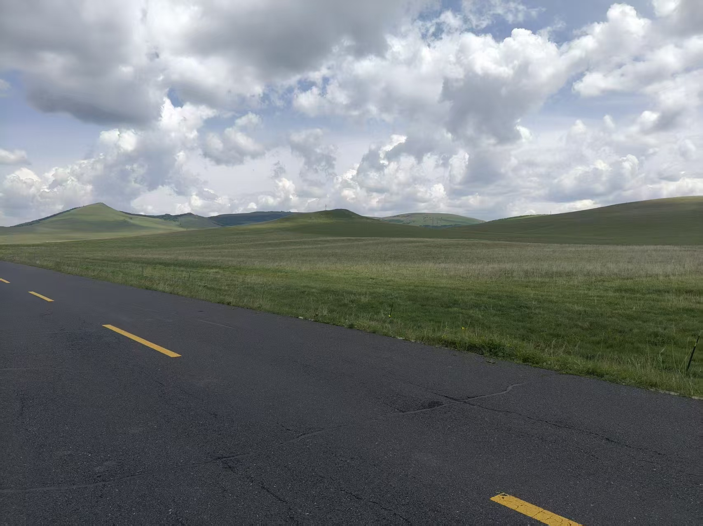
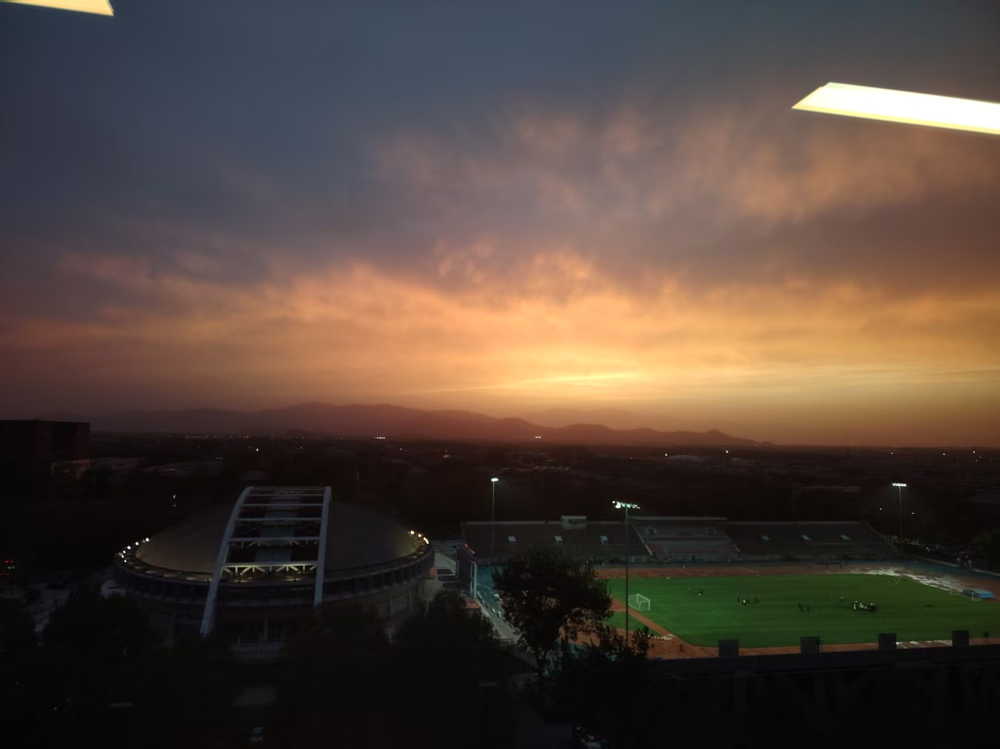
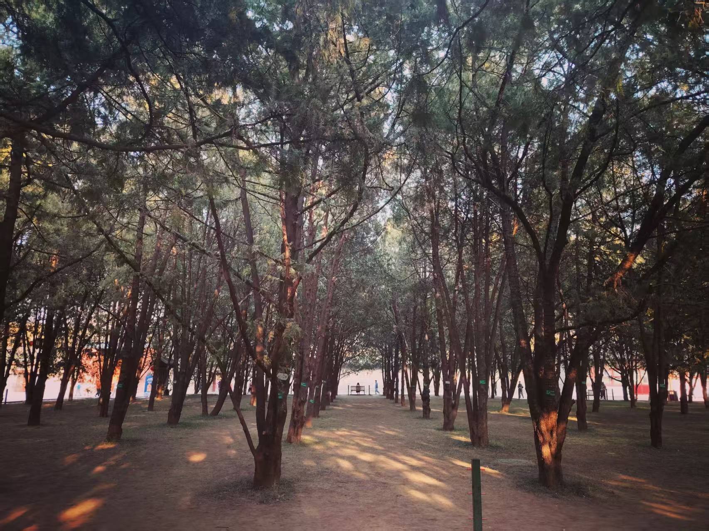
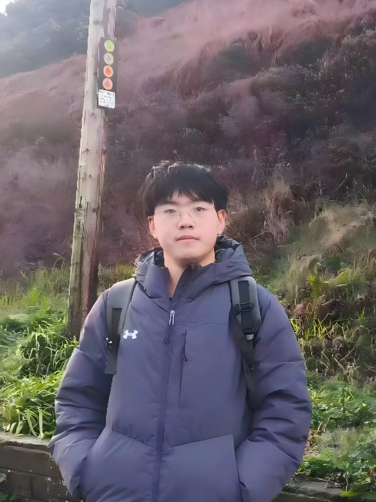
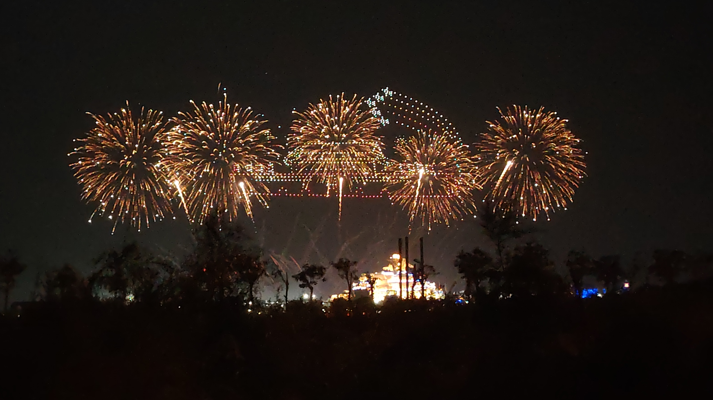
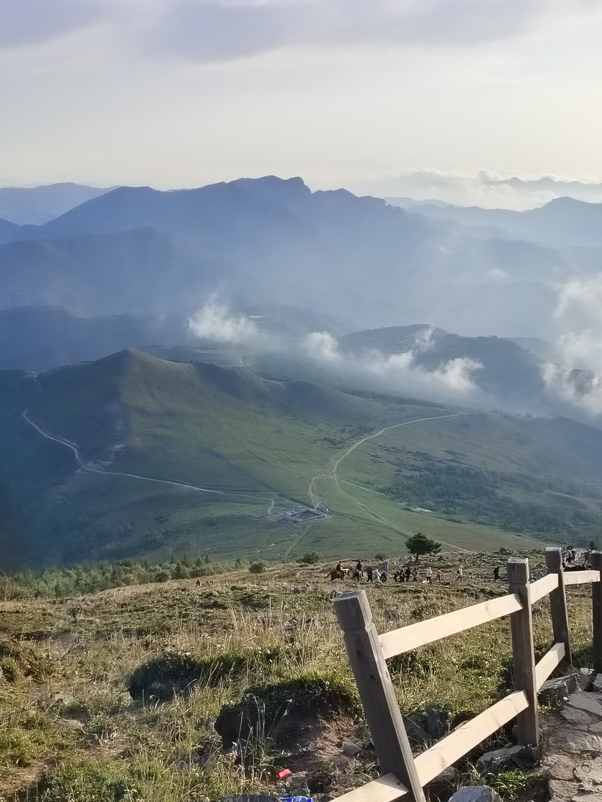
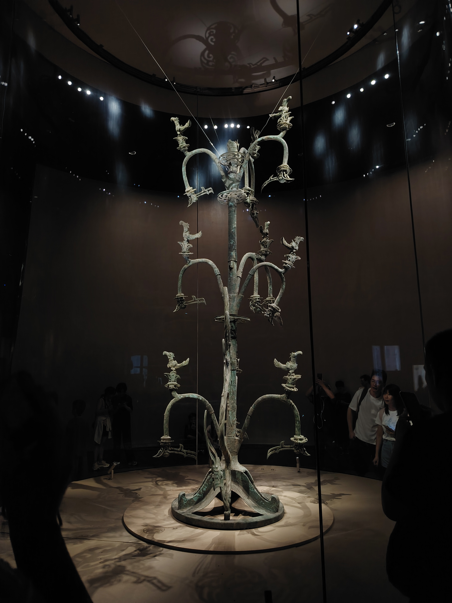
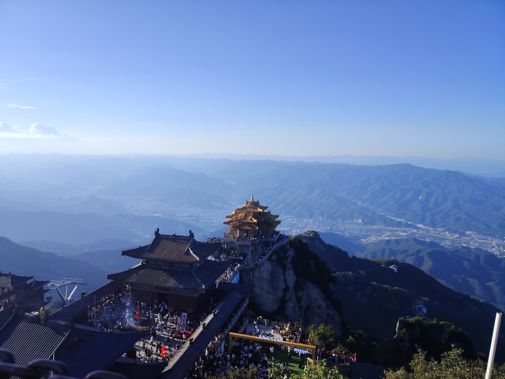
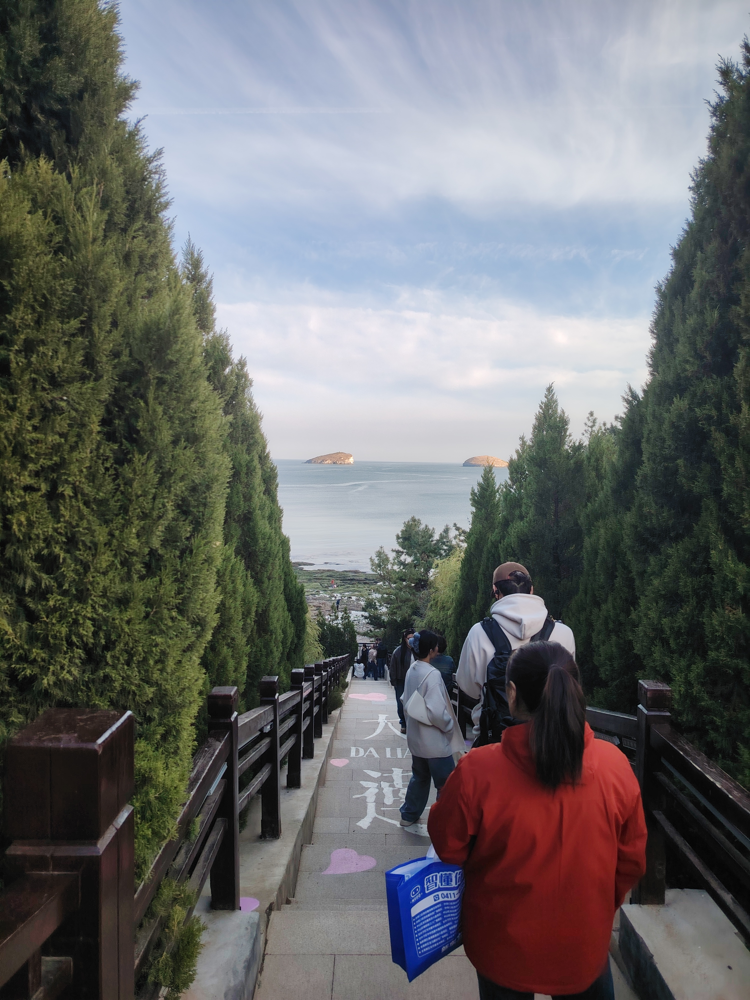
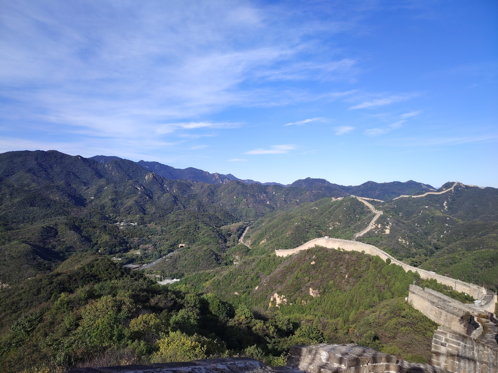

## About Me

I'm currently a sophomore undergraduate in the [Department of Computer Science and Technology](https://www.cs.tsinghua.edu.cn/en/), [Tsinghua University](https://www.tsinghua.edu.cn/en/), pursuing a Bachelor's degree in Computer Science and Technology. I will be joining the [University of Washington](https://www.washington.edu/) as an exchange student in Autumn Quarter 2026.

Currently, I am serving as a research intern at [MARS Lab](http://group.iiis.tsinghua.edu.cn/~marslab/), Tsinghua University, under the supervision of [Prof. Hang Zhao](https://hangzhaomit.github.io/) and [Dr. Shaoting Zhu](https://shaotingzhu.github.io/). Prior to this, I was fortunate to work with [Prof. Yushen Liu](https://yushen-liu.github.io/) and [Weiqi Zhang](https://scholar.google.com/citations?user=sp3zrnYAAAAJ&hl=zh-CN) at the School of Software, Tsinghua University.

## Research Interests

My long-term research goal is to develop **general-purpose intelligent robots** capable of robust real-world environmental understanding and task execution. Currently, my research interests include:

- **Humanoid Robotics**: Locomotion, Loco-manipulation, VLA models.
- **3D Vision**: 3D reconstruction and geometry understanding for robotics.

## News

- **[Sep. 2026]** 🎉 <b>[TTT-Parkour](https://ttt-parkour.github.io)</b> is accepted to **CoRL 2026**!
- **[Autumn 2026]** 🌎 Incoming exchange student at the **University of Washington**.
- **[Feb. 2026]** 🤖 <b>[TTT-Parkour](https://ttt-parkour.github.io)</b> is released on [arXiv](https://arxiv.org/abs/2602.02331)!
- **[Nov. 2025]** 🔬 Joined [MARS Lab](http://group.iiis.tsinghua.edu.cn/~marslab/), Tsinghua University.
- **[2025]** 🏆 Honored to receive the **Academic Excellence Scholarship** of Tsinghua University.



## Education

- **B.S. in Computer Science and Technology**, [Tsinghua University](https://www.tsinghua.edu.cn/en/), 2024–Present.  
  Department of Computer Science and Technology.  
  **GPA:** 3.9/4.0, **Rank:** 7/168.  
  Incoming Exchange Student, University of Washington, Autumn Quarter 2026.

## Selected Projects

- **[TTT-Parkour](https://ttt-parkour.github.io)** · CoRL 2026 · [arXiv](https://arxiv.org/abs/2602.02331)  
  Rapid test-time training for perceptive humanoid parkour over complex terrains. Hands-on experience with the Unitree G1 robot.

- **Gen-Parkour**  · Preprint · In preparation
  Specialize-then-consolidate: distill per-course experts into one generalist humanoid parkour policy across dozens of extremely difficult real-world courses.

## Experience

### Academic / Research

- **[MARS Lab](http://group.iiis.tsinghua.edu.cn/~marslab/), Tsinghua University**  
  **Research Intern** (Humanoid Robot Locomotion): Nov. 2025 – Present.  
  _Topics_: Humanoid parkour, test-time training, terrain generalization.  
  **Advisors**: [Prof. Hang Zhao](https://hangzhaomit.github.io/), [Dr. Shaoting Zhu](https://shaotingzhu.github.io/).

- **School of Software, Tsinghua University**  
  **Research Intern** (3D Vision & Generative Models): Jul. 2025 – Oct. 2025.  
  _Topics_: Diffusion models for 3D part assembly, 3D vision pipelines.  
  **Advisors**: [Prof. Yushen Liu](https://yushen-liu.github.io/), [Weiqi Zhang](https://scholar.google.com/citations?user=sp3zrnYAAAAJ&hl=zh-CN).

## Honors & Awards

- **[2025]** Academic Excellence Scholarship, Tsinghua University.

## Miscs

- **Languages:** English (TOEFL iBT Revised: Official Band 5.0, raw score 21/24), Mandarin (Native).
- **Programming & Tools:** Python, C++, PyTorch, Bash, Git, LaTeX.
- **Libraries & Simulation:** MeshLab, CloudCompare, Blender, Isaac Lab, InstinctLab.

## Gallery

A few photos I've taken along the way.

<link rel="stylesheet" href="./assets/css/simple-slider.css">

  

    

      
      
Yuanmingyuan, Beijing, China — sunset after rain · Aug. 2026

    

    

      
      
Hexigten, Inner Mongolia — road trip on the grassland · Jun. 2026

    

    

      
      
Tsinghua, Beijing — playground under sunset after rain · Apr. 2026

    

    

      
      
Ditan, Beijing — Ocean of Ditan, Shi Tiesheng wrote · Mar. 2026

    

    

      
      
Xi'an, China — lanterns on the City Wall · Spring Festival, Feb. 2026

    

    

      
      
Howth, Ireland — Fáilte go Binn Éadair  · Jan. 2026

    

    

      
      
Kensington Gardens, England · Jan. 2026

    

    

      
      
Tianjin, China - huge Tiananmen‑patterned fireworks over an aircraft carrier · Oct. 2025

    

    

      
      
Zhangjiakou, China - Early‑autumn mountain ranges· Sep. 2025

    

    

      
      
Laojun Mountain, Luoyang - Golden Hall built atop a 2217‑meter‑high mountain peak · Aug. 2025

    

    

      
      
Sanxingdui, Chengdu - 3100‑year‑old bronze relic of the Ancient‑Shu Culture · Jun. 2025

    

    

      
      
Qixian Ridge, Dalian - Coastal forest park overlooking the Yellow Sea · May. 2025

    

    

      
      
Yanqing, Beijing - Ming‑dynasty Great Wall built through mountain valley · Oct. 2024

    

    

      <button class="gallery-btn prev" aria-label="Previous image">
        <svg viewBox="0 0 50 80" width="16" height="16" xml:space="preserve">
          <polyline fill="none" stroke="currentColor" stroke-width="8" stroke-linecap="round" stroke-linejoin="round" points="45,75 5,40 45,5"></polyline>
        </svg>
      </button>
      <button class="gallery-btn next" aria-label="Next image">
        <svg viewBox="0 0 50 80" width="16" height="16" xml:space="preserve">
          <polyline fill="none" stroke="currentColor" stroke-width="8" stroke-linecap="round" stroke-linejoin="round" points="5,5 45,40 5,75"></polyline>
        </svg>
      </button>
    

  

  

    

      
      
      
      
      
      
      
      
      
      
      
      
      
    

  

